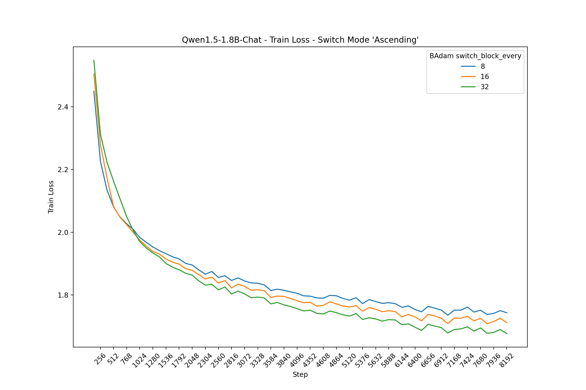
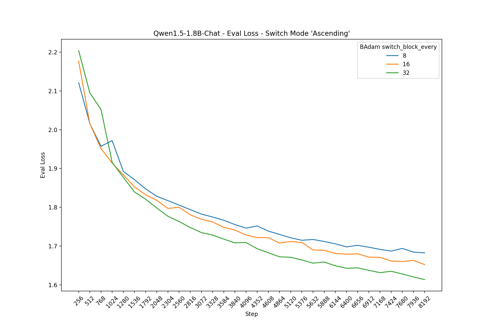
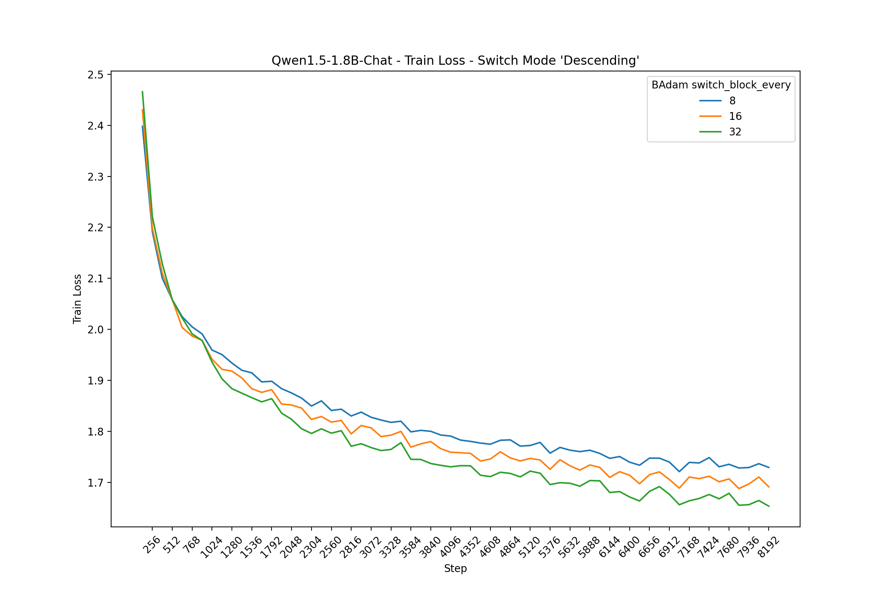
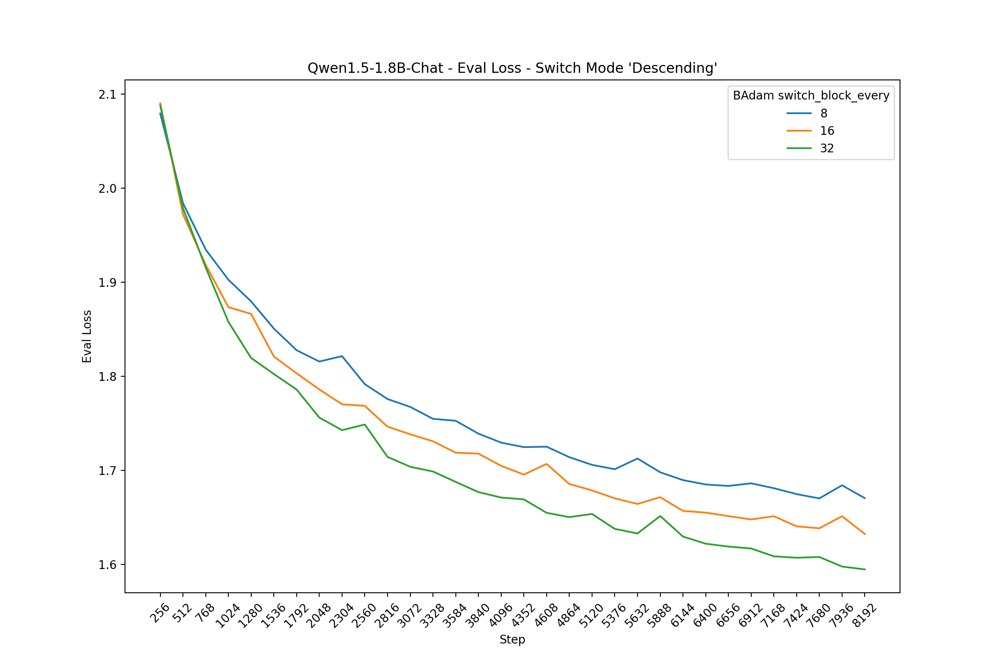

# BAdam-Qwen

This repo contains some code and experiments with BAdam optimizer for full parameter efficient training.

I've used the model Qwen1.5-1.8B-Chat for all the experiments. The vocabulary of the Qwen models is roughly 150K+ so it uses more GPU memory compared to the average LLM when doing full training. On my 16GB GPU it used roughly 10GB when training with BAdam with the provided notebook. Before training starts and the Qwen1.5-1.8B model is just loaded it uses roughly 4.6GB.

## Experiments

All experiments where performed with a fixed amount of 8192 steps. The batch_size (with gradient accumulation) is 16. Maximum input length was set to 1024.

The Adam optimizer was set with a learning rate of 5.0e-5 with linear decay.

Below you can see the various plots showing the training and evaluation loss for BAdam 'switch_mode' when it is set to 'ascending' or 'descending'. The hyperparameter 'switch_block_every' was set with 3 different values: 8, 16 and 32.

During the limited set of experiments I didn't notice any difference with the 2 different 'switch_mode' hyperparameters. A larger value for the hyperparameter 'switch_block_every' results in a better training and evaluation loss.







## References

```
{
https://github.com/Ledzy/BAdam
https://doi.org/10.48550/arXiv.2404.02827
}
```